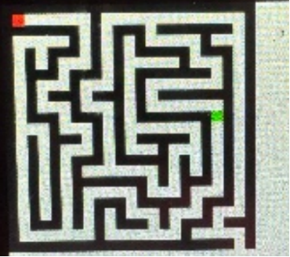
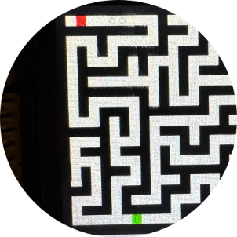

# 游戏设计文档

## 1. 游戏界面的可视化
1. 实现了迷宫地图的显示。游戏开始后以黑色正方块显示迷宫的墙体，空白的方块显示通路。
2. 标记了入口和出口，玩家角色以及怪物。利用红色方块当作玩家，绿色方块当作怪物。玩家的出生点则是迷宫的入口，墙体空白的一角是出口。
3. 游戏通关后，会显示通关消息“Succeeded! KEY_UP to continue”，失败则会提示“you failed”。

## 2. 游戏的人机交互
1. 利用按键和触摸屏以及遥控器控制玩家移动和发射子弹。
2. 利用5×5的点阵显示子弹的剩余数量，提醒玩家。
3. 利用遥控器也可以控制玩家的移动和子弹的发射。

## 3. 游戏的趣味性
1. 地图的生成完全随机，并且游戏难度和地图大小会根据通关数改变。
2. 增加了怪物的生成、显示以及自动移动的功能。怪物的生成会给玩家的通关带来不小的麻烦，以此增加了游戏的趣味性。
3. 玩家利用遥控器的“5”和触摸屏可以发射子弹，子弹可以击中并且消灭怪物。不过需要注意的是，子弹的数量有限，考验了玩家的操作水平。

## 注意事项
本项目为暑期学校的小作业，完全开源。如果在其他地方看到收费的或有其他疑问，请联系我：
- QQ: 2645132058
- 邮箱: 同上

## 运行结果图片

项目可以参考STM32的文档《普中STM32F4xx开发攻略_V3.0--标准库版》。
